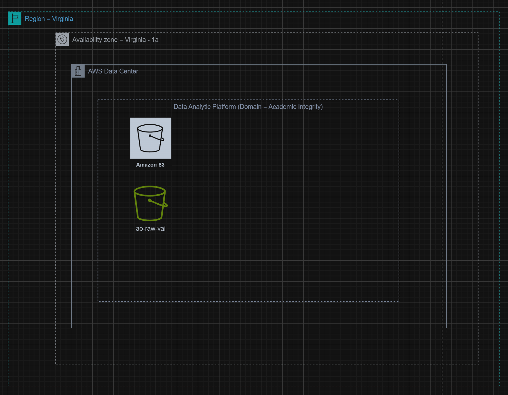
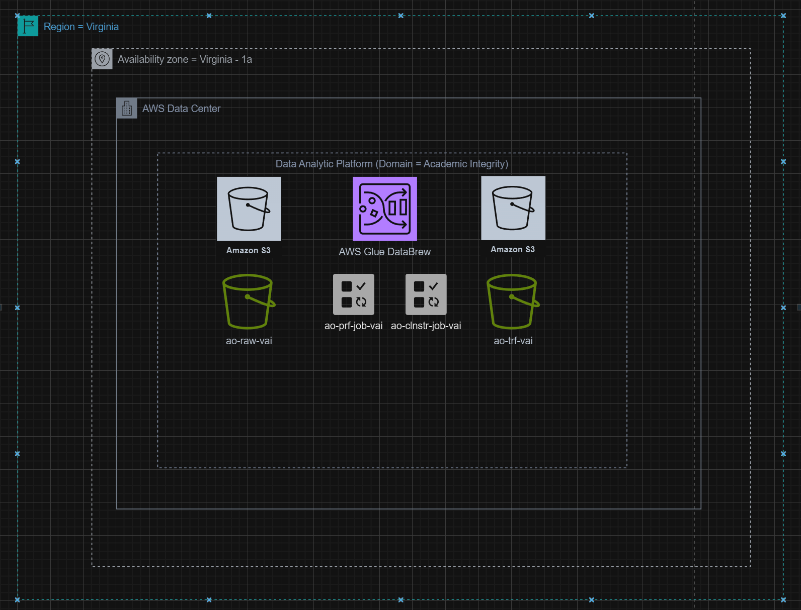
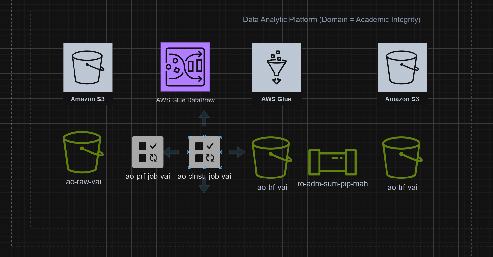
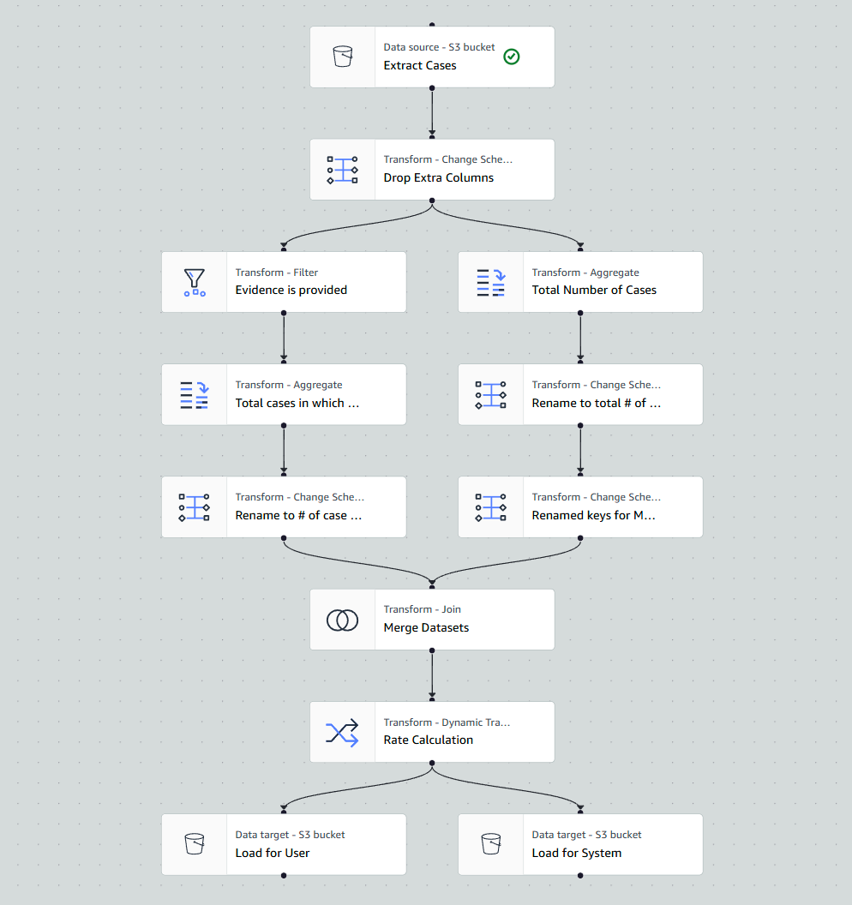
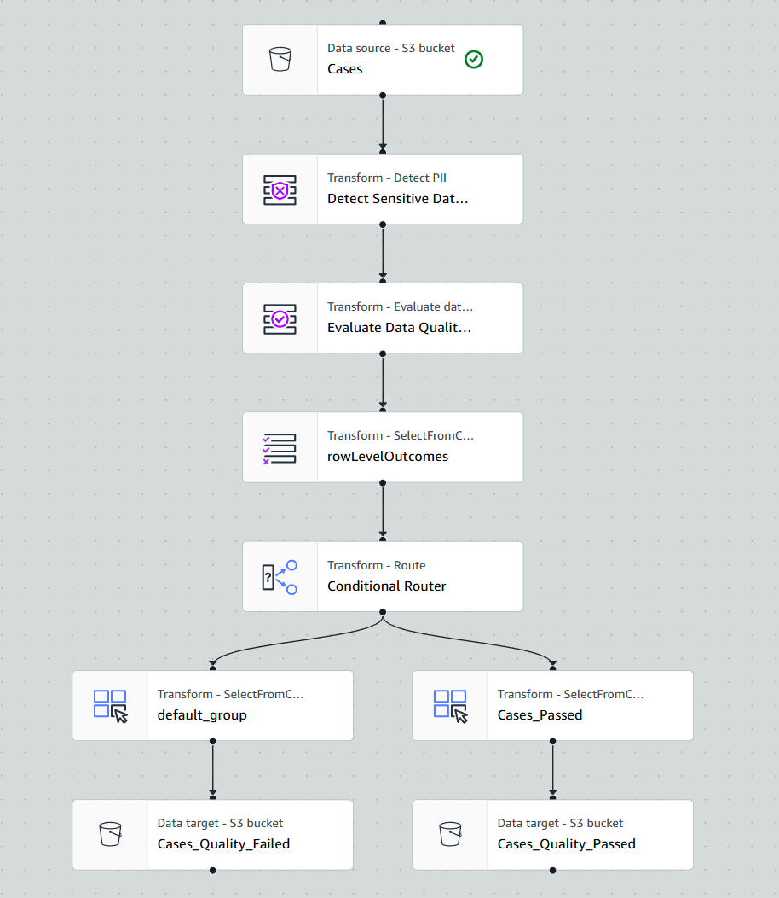
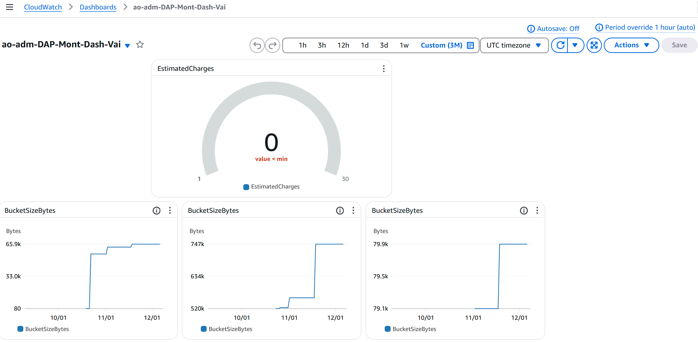
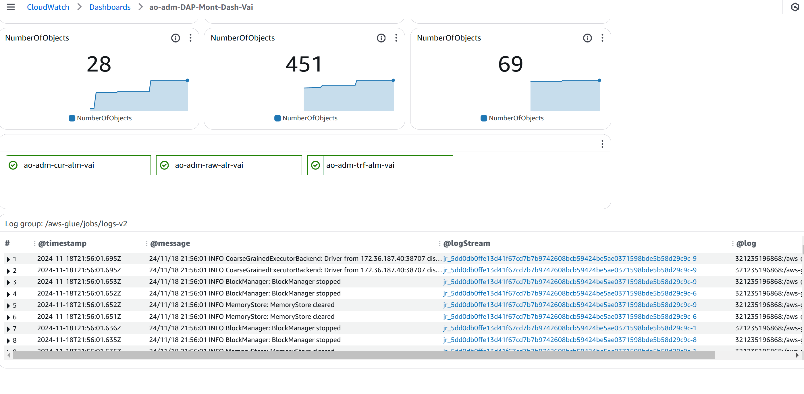

# aws-dataAnalysis-vaibhav

# README: Descriptive Analysis of Academic Integrity Case Records  

## **Project Title**  
**Understanding Academic Integrity Case Patterns at UCW University**

---

## **Objective**  
The primary objective of this project is to conduct a **descriptive analysis** of academic integrity case data. Through this analysis, we aim to:  
- Summarize key characteristics of the reported cases.  
- Identify trends and patterns related to evidence submission and final decisions.  
- Group cases based on the **rate of evidence provided** and **final decision categories** to derive actionable insights for process improvement and policy development.  

---

## **Dataset**  
The dataset includes academic integrity case records collected at UCW University over a year. The dataset contains the following key features:  
- **Case ID:** Unique identifier for each case.  
- **Student ID:** Unique identification number for the student involved.  
- **Violation Type:** Category of the violation (e.g., plagiarism, cheating, collusion).  
- **Date Reported:** Date and time the violation was reported.  
- **Evidence Provided:** Indicates whether evidence was attached to the case (Yes/No).  
- **Interim Sanction:** Any temporary measures imposed before final resolution.  
- **Final Decision:** Outcome of the case (e.g., No Violation, Minor Sanction, Major Sanction).  
- **Faculty ID:** Identifier for the faculty member who reported the case.
  
[Case Records](Project1-data/CaseRecords_List_20241022.xlsx)

---

## **Methodology**  

### **1. Data Collection and Preparation**  
- **Data Ingestion:** Utilize AWS **S3** for storing the case records in CSV format. Data is ingested using an AWS Glue job to extract information into a structured format.  
- **Data Profiling:** Use AWS **DataBrew** to generate insights into the dataset’s structure, completeness, and anomalies.  
- **Data Cleaning:** Handle missing values, ensure correct data types, and remove duplicates using AWS Glue scripts.
- Data Ingestion
  

  Data Cleaning and Profiling
  

### **2. Descriptive Statistics**  
- Calculate key metrics, including:  
  - Percentage of cases where evidence was provided.  
  - Distribution of final decisions by the type of violation.  
  - Group cases by evidence status and summarize the final decision rates.  
  - Average time taken to reach a final decision.
  - Data Pipeline Design
    

    Data Pipeline
    

### **3. Data Enrichment**  
- Augment the dataset by adding external metadata (e.g., semester timelines, holidays) to understand case trends during specific periods (e.g., exam weeks).  
- Enrich evidence-based cases with detailed categorization (e.g., type of evidence provided).

- Data Governance pipeline
  

### **4. Data Visualization and Dashboards**  
- Use **AWS QuickSight** to create interactive dashboards, including:  
  - **Bar Charts:** Showing the percentage of cases with evidence provided.  
  - **Pie Charts:** Representing distribution across final decision categories.  
  - **Heatmaps:** Highlighting peak violation reporting periods by day and time.  
  - **Line Graphs:** Trend analysis of case submissions over the year.

    DashBoard Created
    
    

### **5. Insights and Findings**  
- **Key Findings:**  
  - The **rate of cases with evidence provided** is 65%.  
  - Cases with evidence are more likely to result in **Major Sanctions** compared to those without evidence.  
  - **Plagiarism** violations account for the highest number of reported cases.  
  - Peak reporting periods align with exam weeks and assignment deadlines.  
- **Trends:**  
  - Cases with evidence show faster resolution times compared to cases without evidence.  
  - Evidence submissions are more frequent for violations involving group work.  

### **6. Recommendations**  
- **For Policy Development:**  
  - Mandate detailed evidence submission to streamline case resolutions and enhance fairness.  
- **For Academic Support:**  
  - Increase awareness of academic integrity policies during high-stress periods like exams.  
- **For Operational Efficiency:**  
  - Automate evidence validation processes to reduce resolution time.  

---

## **Tools and Technologies**  
- **AWS Services:**  
  - **S3**: Data storage and ingestion.  
  - **Glue**: Data preparation (profiling and cleaning).  
  - **QuickSight**: Interactive dashboards for visualization.  
  - **IAM**: For secure access management.  
- **Python:** Pandas, Matplotlib, Seaborn for exploratory data analysis.  
- **Power BI:** For supplementary dashboard creation.  

---

## **Deliverables**  
1. **Detailed Report:** Summarizing methods, findings, and recommendations.  
2. **Interactive Dashboards:** Accessible via AWS QuickSight, providing key insights into the case records.  
3. **Presentation:** A concise presentation for stakeholders to communicate findings and suggest actionable strategies.  

---

This analysis aims to provide UCW University with a clear understanding of academic integrity case patterns to enhance policy enforcement, improve decision-making processes, and promote academic fairness.
